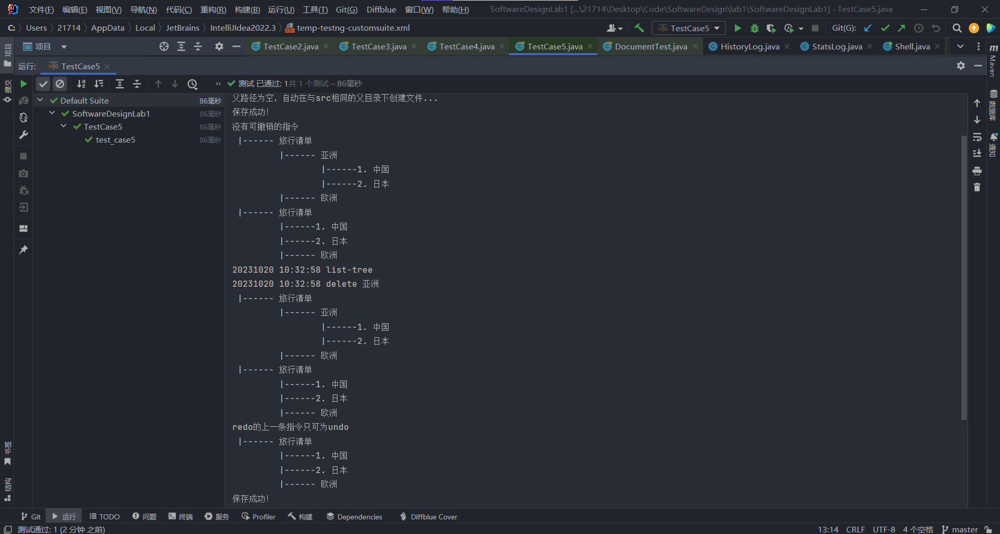

<h1>lab1-report</h1>

<h2>一、功能完成度列表</h2>

<ol>
&ensp;
<li>load 文件路径 &emsp;&emsp;&emsp;&emsp;&emsp;&emsp;&emsp;&emsp;&emsp;&#x2714;

&ensp;

<li>save&emsp;&emsp;&emsp;&emsp;&emsp;&emsp;&emsp;&emsp;&emsp;&emsp;&emsp;&emsp;&emsp;&#x2714;

&ensp;

<li>insert [行号] 标题/文本&emsp;&emsp;&emsp;&emsp;&emsp;&emsp;&#x2714;

&ensp;

<li>append-head 标题/文本&emsp;&emsp;&emsp;&emsp;&emsp;&#x2714;

&ensp;

<li>append-tail 标题/文本&emsp;&emsp;&emsp;&emsp;&emsp;&emsp;&#x2714;

&ensp;

<li>delete 标题/文本  or   delete 行号&emsp;&emsp;&#x2714;

&ensp;

<li>undo&emsp;&emsp;&emsp;&emsp;&emsp;&emsp;&emsp;&emsp;&emsp;&emsp;&emsp;&emsp;&emsp;&emsp;&#x2714;

&ensp;

<li>redo&emsp;&emsp;&emsp;&emsp;&emsp;&emsp;&emsp;&emsp;&emsp;&emsp;&emsp;&emsp;&emsp;&emsp;&#x2714;

&ensp;

<li>list&emsp;&emsp;&emsp;&emsp;&emsp;&emsp;&emsp;&emsp;&emsp;&emsp;&emsp;&emsp;&emsp;&emsp;&emsp;&#x2714;

&ensp;

<li>list-tree&emsp;&emsp;&emsp;&emsp;&emsp;&emsp;&emsp;&emsp;&emsp;&emsp;&emsp;&emsp;&emsp;&#x2714;

&ensp;

<li>dir-tree [目录]&emsp;&emsp;&emsp;&emsp;&emsp;&emsp;&emsp;&emsp;&emsp;&emsp;&#x2714;

&ensp;

<li>history [数量]&emsp;&emsp;&emsp;&emsp;&emsp;&emsp;&emsp;&emsp;&emsp;&emsp;&#x2714;

&ensp;

<li>stats [all | current]&emsp;&emsp;&emsp;&emsp;&emsp;&emsp;&emsp;&emsp;&#x2714;

&ensp;

<h2>二、使用说明</h2>
<ol>
&ensp;
<li>项目采用maven进行管理，使用IDEA进行开发。源代码在src/main中，测试代码在src/test中。

&ensp;

<li>项目使用命令模式设计，src/main下包含command文件夹，invoker文件夹，receiver文件夹，Shell.java文件。command、invoker和receiver是标准命令模式框架，Shell.java为交互式命令行程序，运行时只需运行Shell.java便可开启一个会话。

&ensp;

<li>src/test下包含receiver文件夹和Testcases文件夹。receiver文件夹中含有DocumentTest.java，是对document类的部分功能测试，主要检验基础的编辑功能。Testcases文件夹中含有5个测试文件，分别对应lab1助教给出的5个测试用例，不通过assert语句判断测试的正确性，而应检验测试用例使用list-tree的输出是否符合预期。如下： 

</ol>
